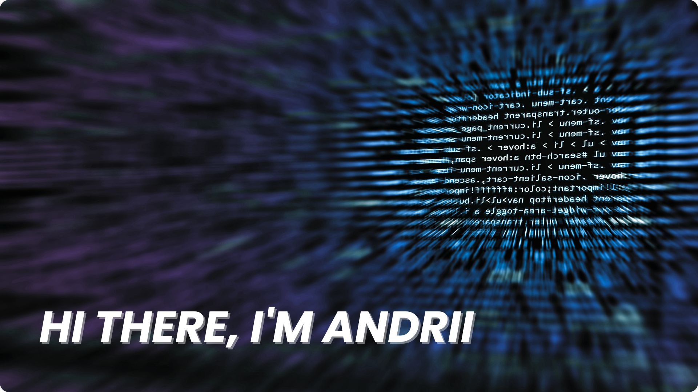

## Hi there 👋 , I'm Andrii, a Web Developer:

🎯 I specialize in Typescript, React and Next.js development

👨🏼‍💻 Working as a web developer since 2021

🛜 Currently working on becoming a full-stack developer

🌍 Based in Germany

📫 How to reach me: andrii.holubenko@web.de

🤝 Open to collaborating on interesting web projects

📚 Always learning and exploring new technologies

## 🌐 Socials:
 

# 💻 Tech Stack:
                                

# 📊 GitHub Stats:

### 📈 Contribution Overview

    

### 🔥 Contribution Streak

    

### 🛠️ Top Technologies

    

<picture>
  <source media="(prefers-color-scheme: dark)" srcset="https://raw.githubusercontent.com/andrey-golubenko/andrey-golubenko/output/github-snake-dark.svg" />
  <source media="(prefers-color-scheme: light)" srcset="https://raw.githubusercontent.com/andrey-golubenko/andrey-golubenko/output/github-snake.svg" />
  
</picture>
